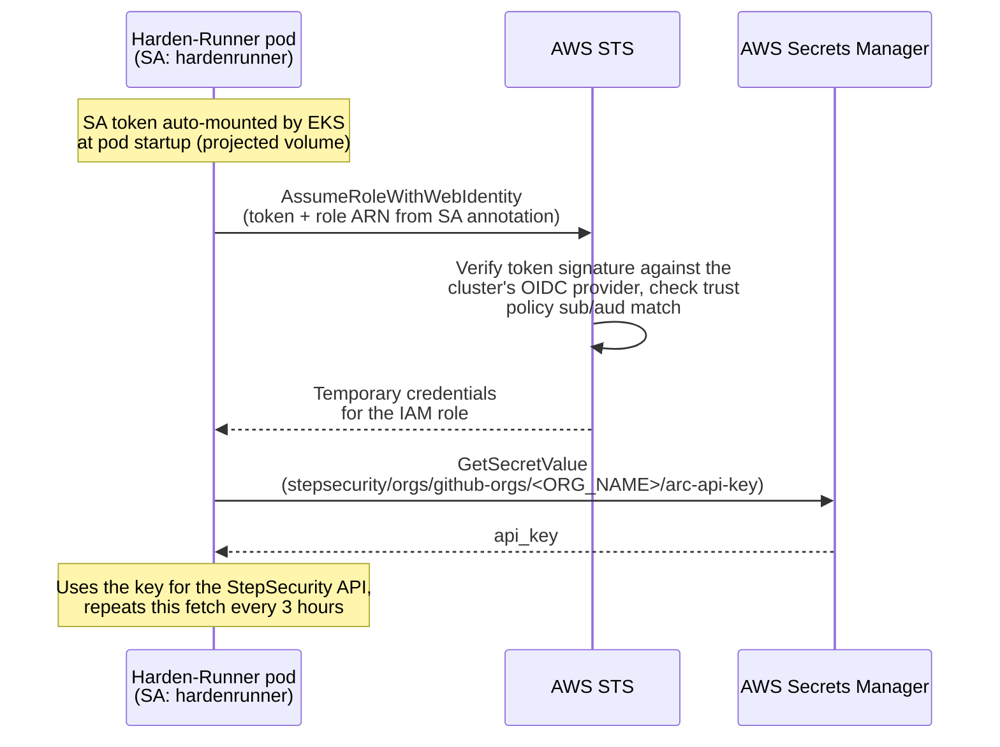

# Kubernetes ARC Harden-Runner: Keyless API Key Setup

This guide describes the one-time setup required in your AWS account and Helm
configuration to enable keyless mode for Kubernetes runners (ARC). In keyless
mode, the Harden-Runner agent DaemonSet retrieves its StepSecurity API key
from AWS Secrets Manager in your account and refreshes it periodically, so
key rotation no longer requires a Helm upgrade or pod restart.

The setup is four steps: create the secret (Step 1), create an IAM role the
DaemonSet can assume via IRSA (Step 2), point the Helm chart at them
(Step 3), and verify (Step 4).

## How it works

1. The Harden-Runner agent DaemonSet authenticates to AWS using IAM Roles
   for Service Accounts (IRSA).
2. On startup, and every few hours after, it reads the API key from a
   secret in AWS Secrets Manager in your account.
3. The refreshed key takes effect immediately, with no restarts.

Everything stays inside your AWS account: the secret, the IAM role, and the
cluster.

## How IRSA works

IRSA (IAM Roles for Service Accounts) lets a pod call AWS APIs with
temporary credentials tied to its Kubernetes service account, with no
long-lived AWS keys stored anywhere:

1. Your EKS cluster has an OIDC issuer, registered as an identity provider
   in IAM (the prerequisite below). Kubernetes issues each pod a short-lived
   signed JWT for its service account.
2. Because the `hardenrunner` service account is annotated with the IAM role
   ARN, EKS automatically mounts that token into the DaemonSet pods and
   points the AWS SDK at it.
3. The agent calls STS `AssumeRoleWithWebIdentity`, presenting the token.
   STS verifies the token's signature against the cluster's OIDC provider
   and checks the role's trust policy, which only matches
   `system:serviceaccount:<namespace>:hardenrunner`.
4. STS returns temporary credentials for the role. The role's only
   permission is `secretsmanager:GetSecretValue` on the one API key secret,
   so that is all the pod can do with them.



## Prerequisites

- EKS cluster with an IAM OIDC provider associated. Clusters do **not** have
  one by default; check first:

  ```bash
  ISSUER=$(aws eks describe-cluster --name <CLUSTER_NAME> --region <AWS_REGION> \
    --query 'cluster.identity.oidc.issuer' --output text)
  aws iam list-open-id-connect-providers | grep "${ISSUER#https://}" \
    || echo "No OIDC provider - associate one (see below)"
  ```

  If missing, associate one (one-time per cluster):

  ```bash
  eksctl utils associate-iam-oidc-provider --cluster <CLUSTER_NAME> --region <AWS_REGION> --approve
  ```

  Without `eksctl`:

  ```bash
  aws iam create-open-id-connect-provider \
    --url "$ISSUER" \
    --client-id-list sts.amazonaws.com \
    --thumbprint-list 9e99a48a9960b14926bb7f3b02e22da2b0ab7280
  ```

  (The thumbprint argument is required by the API but unused for EKS
  issuers; AWS pins the root CA for EKS OIDC endpoints.)

- Your StepSecurity organization name (referred to as `<ORG_NAME>` below).
- The API key for Kubernetes runners (ARC), provided by StepSecurity.
  StepSecurity issues two keys per scenario (a primary and a secondary key);
  use the primary key here. If you also use Harden-Runner on VM runners,
  that scenario has its own separate key pair and secret
  (`stepsecurity/orgs/github-orgs/<ORG_NAME>/vm-api-key`); the keys are not
  interchangeable between scenarios.

All commands below assume these shell variables; set them once:

```bash
export CLUSTER_NAME="<your-eks-cluster>"
export AWS_REGION="<region>"          # e.g. us-east-1
export ORG_NAME="<your-github-org>"
export NAMESPACE="kube-system"        # namespace where Harden-Runner is installed
export SERVICE_ACCOUNT="hardenrunner" # default chart service account name
export ROLE_NAME="StepSecurityHardenRunnerSecretReader"

export ACCOUNT_ID=$(aws sts get-caller-identity --query Account --output text)
export OIDC_ISSUER=$(aws eks describe-cluster --name "$CLUSTER_NAME" --region "$AWS_REGION" \
  --query 'cluster.identity.oidc.issuer' --output text)
export OIDC_PROVIDER="${OIDC_ISSUER#https://}"
```

## Step 1: Create the secret in AWS Secrets Manager

The secret lives in the same region as your cluster (or the region you will
configure in Step 3), with this exact name:
`stepsecurity/orgs/github-orgs/<ORG_NAME>/arc-api-key`. The value must be a JSON
object containing the API key: `{"api_key": "..."}`.

```bash
export SECRET_NAME="stepsecurity/orgs/github-orgs/${ORG_NAME}/arc-api-key"

# Prompt for the key so it never lands in shell history:
read -r -s -p "StepSecurity API key: " STEPSECURITY_API_KEY; echo

aws secretsmanager create-secret \
  --name "$SECRET_NAME" \
  --description "StepSecurity ARC Harden-Runner API key for ${ORG_NAME} (keyless mode)" \
  --secret-string "{\"api_key\": \"${STEPSECURITY_API_KEY}\"}" \
  --region "$AWS_REGION"

export SECRET_ARN=$(aws secretsmanager describe-secret --secret-id "$SECRET_NAME" \
  --region "$AWS_REGION" --query 'ARN' --output text)
echo "$SECRET_ARN"
```

If the secret already exists, update its value instead:

```bash
aws secretsmanager put-secret-value \
  --secret-id "$SECRET_NAME" \
  --secret-string "{\"api_key\": \"${STEPSECURITY_API_KEY}\"}" \
  --region "$AWS_REGION"
```

## Step 2: Create an IAM role for the Harden-Runner service account (IRSA)

The role needs only one permission: read access to the secret created above.
The trust policy restricts it to the Harden-Runner service account in your
cluster.

> The default service account is `hardenrunner` in the namespace where the
> chart is installed (typically `kube-system`). Adjust `SERVICE_ACCOUNT` /
> `NAMESPACE` if you install elsewhere or override the service account name
> (`serviceAccount.name` or `fullnameOverride`).

**2a. Create the role with its trust policy:**

```bash
cat > /tmp/harden-runner-trust.json <<EOF
{
  "Version": "2012-10-17",
  "Statement": [
    {
      "Effect": "Allow",
      "Principal": {
        "Federated": "arn:aws:iam::${ACCOUNT_ID}:oidc-provider/${OIDC_PROVIDER}"
      },
      "Action": "sts:AssumeRoleWithWebIdentity",
      "Condition": {
        "StringEquals": {
          "${OIDC_PROVIDER}:sub": "system:serviceaccount:${NAMESPACE}:${SERVICE_ACCOUNT}",
          "${OIDC_PROVIDER}:aud": "sts.amazonaws.com"
        }
      }
    }
  ]
}
EOF

aws iam create-role \
  --role-name "$ROLE_NAME" \
  --description "IRSA role for ARC Harden-Runner keyless API key retrieval" \
  --assume-role-policy-document file:///tmp/harden-runner-trust.json
```

(If the role already exists, use
`aws iam update-assume-role-policy --role-name "$ROLE_NAME" --policy-document file:///tmp/harden-runner-trust.json`
instead.)

**2b. Attach the permission policy (read exactly this one secret):**

```bash
cat > /tmp/harden-runner-permission.json <<EOF
{
  "Version": "2012-10-17",
  "Statement": [
    {
      "Effect": "Allow",
      "Action": "secretsmanager:GetSecretValue",
      "Resource": "${SECRET_ARN}"
    }
  ]
}
EOF

aws iam put-role-policy \
  --role-name "$ROLE_NAME" \
  --policy-name "StepSecurityKeylessSecretRead" \
  --policy-document file:///tmp/harden-runner-permission.json

rm /tmp/harden-runner-trust.json /tmp/harden-runner-permission.json
```

**2c. Capture the role ARN for Step 3:**

```bash
export ROLE_ARN=$(aws iam get-role --role-name "$ROLE_NAME" --query 'Role.Arn' --output text)
echo "$ROLE_ARN"
```

## Step 3: Helm values

Add the following to your Harden-Runner Helm values:

```yaml
env:
  orgName: "<ORG_NAME>"
  keyless:
    enabled: "true"
    # Optional: only needed if the secret is in a different region than the
    # cluster. Leave unset to use the cluster's region.
    # region: "us-east-1"

serviceAccount:
  annotations:
    eks.amazonaws.com/role-arn: "<ROLE_ARN from Step 2c>"
```

With keyless mode enabled, the `apiKey` and `apiKeySecretName` values are
ignored and can be removed.

Apply the change:

```bash
helm upgrade arc-harden-runner <chart> -f values.yaml -n kube-system
```

## Step 4: Verify

First confirm the IRSA wiring: the service account carries the role
annotation, and EKS injected the AWS credentials into the pods.

```bash
kubectl -n "$NAMESPACE" get sa "$SERVICE_ACCOUNT" \
  -o jsonpath='{.metadata.annotations.eks\.amazonaws\.com/role-arn}'; echo

kubectl -n "$NAMESPACE" get pod -l app=arc-harden-runner \
  -o jsonpath='{.items[0].spec.containers[0].env[?(@.name=="AWS_ROLE_ARN")].value}'; echo
```

Both should print the role ARN from Step 2c. If the second one is empty, the
pods predate the annotation; restart them
(`kubectl -n "$NAMESPACE" rollout restart daemonset -l app=arc-harden-runner`),
since the credentials are injected only at pod creation.

Then check the Harden-Runner pod logs after rollout:

```bash
kubectl -n kube-system logs -l app=arc-harden-runner --tail=50
```

A successful startup fetches the key before monitoring begins. If the pod
cannot read the secret, the logs will show the Secrets Manager error and the
pod will keep retrying until access is fixed. The most common causes are:

| Symptom in logs | Likely cause |
|---|---|
| `AccessDeniedException` | IAM role missing `secretsmanager:GetSecretValue` on the secret ARN, or trust policy `sub` doesn't match the service account |
| `ResourceNotFoundException` | Secret name doesn't match `stepsecurity/orgs/github-orgs/<ORG_NAME>/arc-api-key`, or wrong region |
| `orgName is required` | `env.orgName` not set in Helm values |
| No AWS credentials | Service account annotation missing or OIDC provider not associated with the cluster |

## Key rotation

Key rotation is covered in
[key-rotation-flow-generic.md](key-rotation-flow-generic.md). Rotation needs no Helm
changes or pod restarts; the DaemonSet picks up the new key at its next
refresh.
