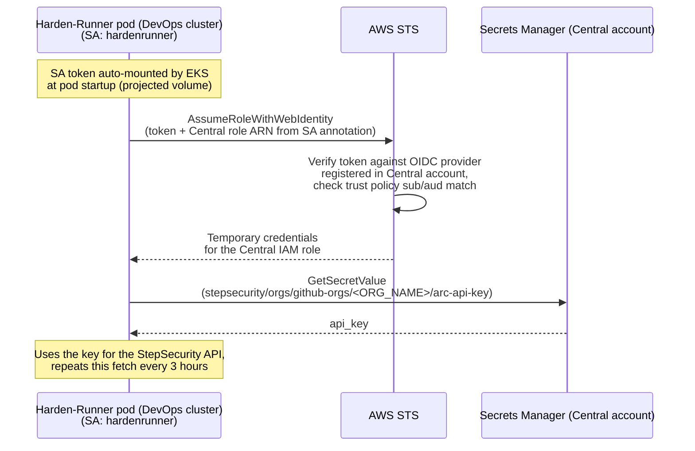

# Kubernetes ARC Harden-Runner: Keyless API Key Setup (Cross-Account)

This guide describes the one-time setup required to enable keyless mode for
Kubernetes runners (ARC) when the **EKS cluster and the secret live in
different AWS accounts**, and splits the work by team:

| Component | Account | Owned by |
| --- | --- | --- |
| EKS cluster + Harden-Runner DaemonSet + Helm release | **DevOps account** (`111111111111` in examples) | DevOps team |
| Secrets Manager secret + IAM role + OIDC provider registration | **Central account** (`222222222222` in examples) | Central team |

In keyless mode, the Harden-Runner agent DaemonSet retrieves its StepSecurity
API key from AWS Secrets Manager and refreshes it periodically, so key
rotation requires no Helm upgrade or pod restart, and no involvement from
the DevOps team.

## Responsibilities at a glance

| Phase | Task | Team | Account |
| --- | --- | --- | --- |
| A1 | Gather cluster OIDC issuer + SA details, hand off to Central | DevOps | DevOps |
| B1 | Register the cluster's OIDC provider in IAM | Central | Central |
| B2 | Create the API key secret in Secrets Manager | Central | Central |
| B3 | Create the IAM role (trust + permission policy), hand role ARN to DevOps | Central | Central |
| C1 | Update Helm values with the Central role ARN and apply | DevOps | DevOps |
| C2 | Verify wiring and pod logs | DevOps | DevOps (cluster) |
| Ongoing | Key rotation | Central | Central |
| Ongoing | Notify Central on cluster recreation (issuer change) | DevOps | n/a |
| Ongoing | Update provider + trust policy on issuer change | Central | Central |

**Handoffs between teams:**

- DevOps → Central (before Part B): OIDC issuer URL, Kubernetes namespace,
  service account name, StepSecurity org name, desired secret region.
- Central → DevOps (before Part C): IAM role ARN, secret region (if different
  from the cluster's region).

Neither team needs credentials for the other team's account at any point.

## Why the role must live in the Central account

The agent looks up the secret **by name**
(`stepsecurity/orgs/github-orgs/<ORG_NAME>/arc-api-key`), not by full ARN. A
name-only `GetSecretValue` call resolves in the account of the credentials
making the call. Therefore:

- A role in the DevOps account combined with a resource policy on the Central
  secret **will not work**: the name would resolve in the DevOps account
  and the agent would get `ResourceNotFoundException`.
- Instead, the pod assumes a role **in the Central account** directly, using
  IRSA's cross-account trust. Once the role is assumed, the secret lookup
  and KMS decryption are same-account operations inside Central, so the default
  `aws/secretsmanager` KMS key works and no customer-managed key or resource
  policy is required.

## How it works

1. The Harden-Runner agent DaemonSet in the DevOps cluster authenticates to
   AWS using IAM Roles for Service Accounts (IRSA).
2. The DevOps cluster's OIDC issuer is registered as an identity provider in
   the **Central** account's IAM (Part B1). Kubernetes issues each pod a
   short-lived signed JWT for its service account.
3. Because the `hardenrunner` service account is annotated with the Central
   account's role ARN, EKS automatically mounts the token into the DaemonSet
   pods and points the AWS SDK at it. The EKS webhook does not care that the
   ARN belongs to another account.
4. The agent calls STS `AssumeRoleWithWebIdentity`, presenting the token.
   STS verifies the token's signature against the OIDC provider registered
   in the Central account and checks the role's trust policy, which only matches
   `system:serviceaccount:<namespace>:hardenrunner` from this specific
   cluster's issuer.
5. STS returns temporary credentials for the Central role. The role's only
   permission is `secretsmanager:GetSecretValue` on the one API key secret
   in the Central account, so that is all the pod can do with them.
6. On startup, and every few hours after, the agent reads the API key from
   the secret. The refreshed key takes effect immediately, with no restarts.



## Prerequisites

- **DevOps team:** admin access to the EKS cluster and permission to run
  `aws eks describe-cluster` in the DevOps account; ability to upgrade the
  Harden-Runner Helm release.
- **Central team:** IAM and Secrets Manager permissions in the Central account
  (create OIDC provider, create role, create secret).
- Your StepSecurity organization name (referred to as `<ORG_NAME>` below).
- The API key for Kubernetes runners (ARC), provided by StepSecurity. It is held
  by whichever team manages the StepSecurity relationship, entered by the
  Central team in Part B2. StepSecurity issues two keys per scenario (a primary
  and a secondary key); use the primary key here. If you also use
  Harden-Runner on VM runners, that scenario has its own separate key pair
  and secret (`stepsecurity/orgs/github-orgs/<ORG_NAME>/vm-api-key`); the
  keys are not interchangeable between scenarios.

---

# Part A: DevOps team: gather and hand off cluster details

**Run with DevOps account credentials.**

```bash
export CLUSTER_NAME="<your-eks-cluster>"
export AWS_REGION="<region>"                    # cluster region, e.g. us-east-1

export OIDC_ISSUER=$(aws eks describe-cluster --name "$CLUSTER_NAME" --region "$AWS_REGION" \
  --query 'cluster.identity.oidc.issuer' --output text)
echo "$OIDC_ISSUER"
# e.g. https://oidc.eks.us-east-1.amazonaws.com/id/EXAMPLED539D4633E53DE1B71EXAMPLE
```

Hand the following to the Central team:

| Item | Value |
| --- | --- |
| OIDC issuer URL | output of the command above |
| Namespace | `kube-system` (or wherever the chart is installed) |
| Service account name | `hardenrunner` (or your override via `serviceAccount.name` / `fullnameOverride`) |
| StepSecurity org name | `<ORG_NAME>` |
| Cluster region | `$AWS_REGION` (so Central can create the secret in the same region, or tell you otherwise) |

> No IAM changes are needed in the DevOps account for this setup. The
> cluster's OIDC provider does **not** need to be registered in the DevOps
> account's IAM for this role to work (though it commonly already is if
> other IRSA roles exist there).

---

# Part B: Central team: provider, secret, and role

**All commands in this part run with Central account credentials.** Set the
variables from the DevOps handoff first:

```bash
export OIDC_ISSUER="<issuer URL from DevOps>"
export OIDC_PROVIDER="${OIDC_ISSUER#https://}"
export NAMESPACE="kube-system"
export SERVICE_ACCOUNT="hardenrunner"
export ORG_NAME="<github-org>"
export SECRET_REGION="<region>"                 # usually the cluster's region
export ROLE_NAME="StepSecurityHardenRunnerSecretReader"
export SEC_ACCOUNT_ID=$(aws sts get-caller-identity --query Account --output text)
export DEVOPS_ACCOUNT_ID="111111111111"         # for the role description only
```

## B1: Register the cluster's OIDC provider

The issuer URL is public; registering it makes the Central account willing to
verify tokens issued by that cluster.

Check whether it is already registered:

```bash
aws iam list-open-id-connect-providers | grep "$OIDC_PROVIDER" \
  || echo "No OIDC provider in Central account - register one (below)"
```

If missing, register it (one-time per cluster, per account):

```bash
aws iam create-open-id-connect-provider \
  --url "$OIDC_ISSUER" \
  --client-id-list sts.amazonaws.com \
  --thumbprint-list 9e99a48a9960b14926bb7f3b02e22da2b0ab7280
```

(The thumbprint argument is required by the API but unused for EKS issuers;
AWS pins the root CA for EKS OIDC endpoints.)

> **Note:** `eksctl utils associate-iam-oidc-provider` cannot be used here;
> it registers the provider in the cluster's own account. For the Central
> account, use the raw `aws iam create-open-id-connect-provider` call above.

## B2: Create the secret in Secrets Manager

The secret lives in `SECRET_REGION`, with this exact name:
`stepsecurity/orgs/github-orgs/<ORG_NAME>/arc-api-key`. The value must be a
JSON object containing the API key: `{"api_key": "..."}`.

```bash
export SECRET_NAME="stepsecurity/orgs/github-orgs/${ORG_NAME}/arc-api-key"

# Prompt for the key so it never lands in shell history:
read -r -s -p "StepSecurity API key: " STEPSECURITY_API_KEY; echo

aws secretsmanager create-secret \
  --name "$SECRET_NAME" \
  --description "StepSecurity ARC Harden-Runner API key for ${ORG_NAME} (keyless mode, cross-account)" \
  --secret-string "{\"api_key\": \"${STEPSECURITY_API_KEY}\"}" \
  --region "$SECRET_REGION"

export SECRET_ARN=$(aws secretsmanager describe-secret --secret-id "$SECRET_NAME" \
  --region "$SECRET_REGION" --query 'ARN' --output text)
echo "$SECRET_ARN"
```

If the secret already exists, update its value instead:

```bash
aws secretsmanager put-secret-value \
  --secret-id "$SECRET_NAME" \
  --secret-string "{\"api_key\": \"${STEPSECURITY_API_KEY}\"}" \
  --region "$SECRET_REGION"
```

Because the role that reads this secret also lives in the Central account (B3),
the default `aws/secretsmanager` KMS key is sufficient. No secret resource
policy and no customer-managed KMS key are needed.

## B3: Create the IAM role (cross-account IRSA trust)

The role needs only one permission: read access to the secret created above.
The trust policy restricts it to the Harden-Runner service account in the
DevOps cluster.

**B3a. Create the role with its trust policy.** Two things differ from a
same-account IRSA trust policy: the `Federated` principal uses the **Central**
account ID (that is where the provider from B1 lives), while the condition
keys still use the **DevOps cluster's** issuer path:

```bash
cat > /tmp/harden-runner-trust.json <<EOF
{
  "Version": "2012-10-17",
  "Statement": [
    {
      "Effect": "Allow",
      "Principal": {
        "Federated": "arn:aws:iam::${SEC_ACCOUNT_ID}:oidc-provider/${OIDC_PROVIDER}"
      },
      "Action": "sts:AssumeRoleWithWebIdentity",
      "Condition": {
        "StringEquals": {
          "${OIDC_PROVIDER}:sub": "system:serviceaccount:${NAMESPACE}:${SERVICE_ACCOUNT}",
          "${OIDC_PROVIDER}:aud": "sts.amazonaws.com"
        }
      }
    }
  ]
}
EOF

aws iam create-role \
  --role-name "$ROLE_NAME" \
  --description "Cross-account IRSA role for ARC Harden-Runner keyless API key retrieval (cluster in ${DEVOPS_ACCOUNT_ID})" \
  --assume-role-policy-document file:///tmp/harden-runner-trust.json
```

(If the role already exists, use `aws iam update-assume-role-policy
--role-name "$ROLE_NAME" --policy-document
file:///tmp/harden-runner-trust.json` instead.)

**B3b. Attach the permission policy (read exactly this one secret):**

```bash
cat > /tmp/harden-runner-permission.json <<EOF
{
  "Version": "2012-10-17",
  "Statement": [
    {
      "Effect": "Allow",
      "Action": "secretsmanager:GetSecretValue",
      "Resource": "${SECRET_ARN}"
    }
  ]
}
EOF

aws iam put-role-policy \
  --role-name "$ROLE_NAME" \
  --policy-name "StepSecurityKeylessSecretRead" \
  --policy-document file:///tmp/harden-runner-permission.json

rm /tmp/harden-runner-trust.json /tmp/harden-runner-permission.json
```

**B3c. Capture the role ARN and hand it to the DevOps team:**

```bash
export ROLE_ARN=$(aws iam get-role --role-name "$ROLE_NAME" --query 'Role.Arn' --output text)
echo "$ROLE_ARN"
# e.g. arn:aws:iam::222222222222:role/StepSecurityHardenRunnerSecretReader
```

Hand to the DevOps team: the **role ARN**, and the **secret region** if it
differs from the cluster's region.

---

# Part C: DevOps team: Helm values and verification

**Run against the DevOps cluster.** No AWS IAM permissions needed for this
part.

## C1: Helm values

Add the following to your Harden-Runner Helm values. The service account
annotation points at the **Central** account's role ARN; the EKS webhook mounts
the token and sets `AWS_ROLE_ARN` regardless of which account the ARN
belongs to.

```yaml
env:
  orgName: "<ORG_NAME>"
  keyless:
    enabled: "true"
    # Required if the secret's region (from the Central handoff) differs from
    # the cluster's region. Leave unset if they are the same.
    # region: "us-east-1"

serviceAccount:
  annotations:
    eks.amazonaws.com/role-arn: "<ROLE_ARN from the Central team>"
```

With keyless mode enabled, the `apiKey` and `apiKeySecretName` values are
ignored and can be removed.

Apply the change:

```bash
helm upgrade arc-harden-runner <chart> -f values.yaml -n kube-system
```

## C2: Verify

First confirm the IRSA wiring: the service account carries the Central role
annotation, and EKS injected the AWS credentials into the pods.

```bash
export NAMESPACE="kube-system"
export SERVICE_ACCOUNT="hardenrunner"

kubectl -n "$NAMESPACE" get sa "$SERVICE_ACCOUNT" \
  -o jsonpath='{.metadata.annotations.eks\.amazonaws\.com/role-arn}'; echo

kubectl -n "$NAMESPACE" get pod -l app=arc-harden-runner \
  -o jsonpath='{.items[0].spec.containers[0].env[?(@.name=="AWS_ROLE_ARN")].value}'; echo
```

Both should print the Central role ARN. If the second one is empty, the pods
predate the annotation; restart them
(`kubectl -n "$NAMESPACE" rollout restart daemonset -l app=arc-harden-runner`),
since the credentials are injected only at pod creation.

Then check the Harden-Runner pod logs after rollout:

```bash
kubectl -n kube-system logs -l app=arc-harden-runner --tail=50
```

A successful startup fetches the key before monitoring begins. If the pod
cannot read the secret, the logs will show the error and the pod will keep
retrying until access is fixed.

## Troubleshooting

The "fix owner" column tells you which team's side the problem is on.

| Symptom in logs | Likely cause | Fix owner |
| --- | --- | --- |
| `InvalidIdentityToken` / `No OpenIDConnect provider found in your account` | OIDC provider not registered in the Central account (B1 skipped, or run against the wrong account) | Central |
| `AccessDenied` on `AssumeRoleWithWebIdentity` | Trust policy `Federated` ARN uses the DevOps account ID instead of Central's, issuer path typo, or `sub` doesn't match the namespace/service account | Central (values from DevOps handoff) |
| `AccessDeniedException` on `GetSecretValue` | Central role missing `secretsmanager:GetSecretValue` on the secret ARN | Central |
| `ResourceNotFoundException` | Secret name doesn't match `stepsecurity/orgs/github-orgs/<ORG_NAME>/arc-api-key`; secret in a different region than the agent queries (`env.keyless.region` unset or wrong); or the secret was created in the DevOps account instead of Central | Central (name/region) or DevOps (`env.keyless.region`) |
| `orgName is required` | `env.orgName` not set in Helm values | DevOps |
| No AWS credentials | Service account annotation missing, or pods not restarted after annotating | DevOps |

The Central team can also confirm end-to-end identity from its side: CloudTrail
in the Central account records the `AssumeRoleWithWebIdentity` calls, including
the `sub` claim (`system:serviceaccount:kube-system:hardenrunner`), and the
subsequent `GetSecretValue` calls under the role session. The security
account retains full visibility into which workload reads the key.

---

# Ongoing operations

## Key rotation (Central team)

Key rotation is unchanged from the same-account flow (see
`key-rotation-flow-generic.md` in the repository) and is performed entirely
in the Central account (`put-secret-value` on the secret). It needs no Helm
changes, no pod restarts, and no DevOps involvement; the DaemonSet picks up
the new key at its next refresh.

## Cluster recreation (DevOps notifies, Central updates)

If the DevOps cluster is ever rebuilt, its OIDC issuer ID changes and the
trust breaks: pods will log STS errors and keep retrying.

- **DevOps team:** treat "cluster recreated" as an event that must be
  communicated to the Central team, including the new issuer URL (re-run
  Part A).
- **Central team:** register the new issuer (B1) and update the role's trust
  policy with the new issuer path (B3a, using
  `aws iam update-assume-role-policy`). The old provider registration can
  be deleted once no roles reference it.

Codify both accounts' pieces in IaC (Terraform/CloudFormation) so a cluster
rebuild updates the Central-side resources automatically instead of relying on
a manual handoff.

## Adding more clusters (joint)

To let the same Central role serve Harden-Runner in additional DevOps clusters
(or additional accounts):

- **DevOps team:** provide the new cluster's issuer URL, namespace, and
  service account name (Part A).
- **Central team:** register each new issuer (B1) and add one statement per
  cluster to the role's trust policy (B3a). Watch the trust policy size
  limit (2,048 characters by default, raisable to 4,096 via Service
  Quotas).

## Least privilege summary

Nothing in the DevOps account can read the secret except pods running as
`system:serviceaccount:<namespace>:hardenrunner` in the registered
cluster(s), and the role they receive can only call `GetSecretValue` on
this one secret. The API key itself never appears in Helm values, shell
history, or the DevOps account.
