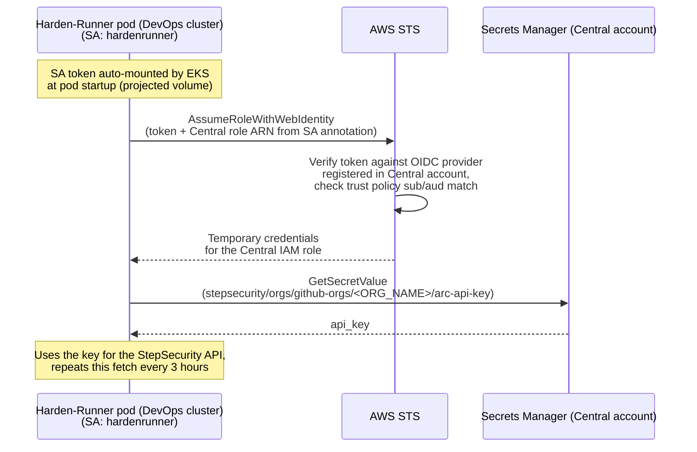
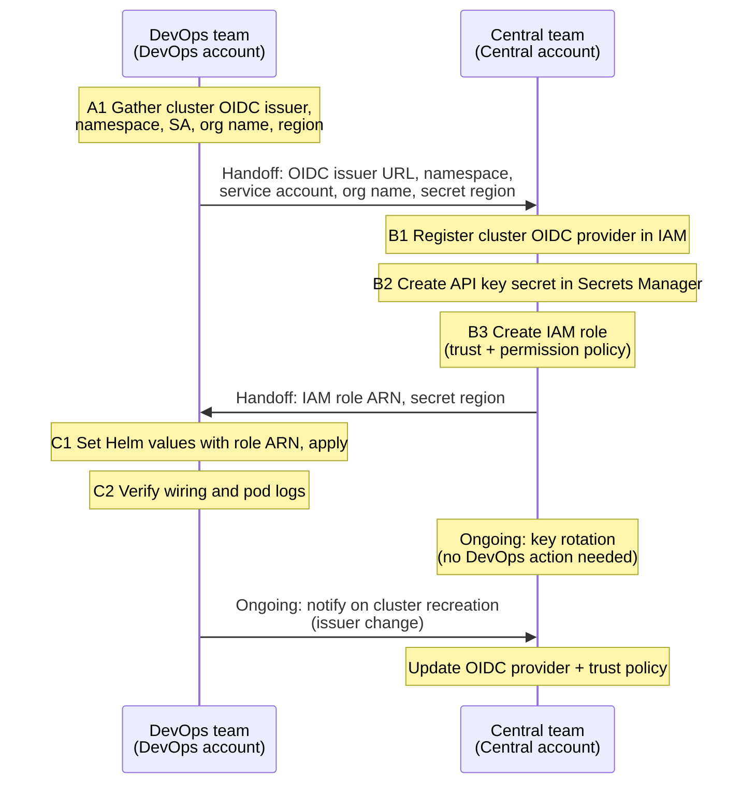
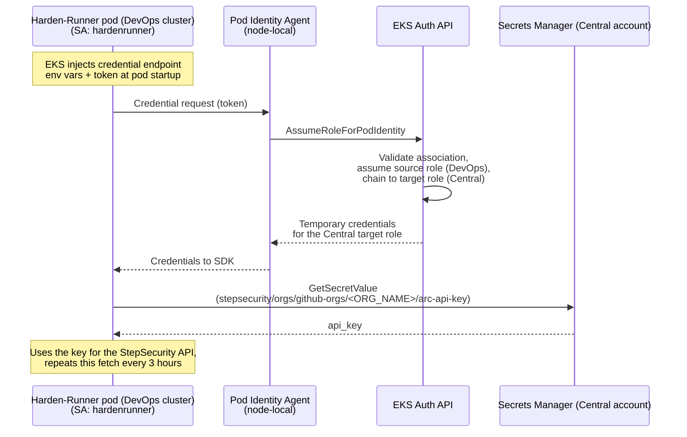
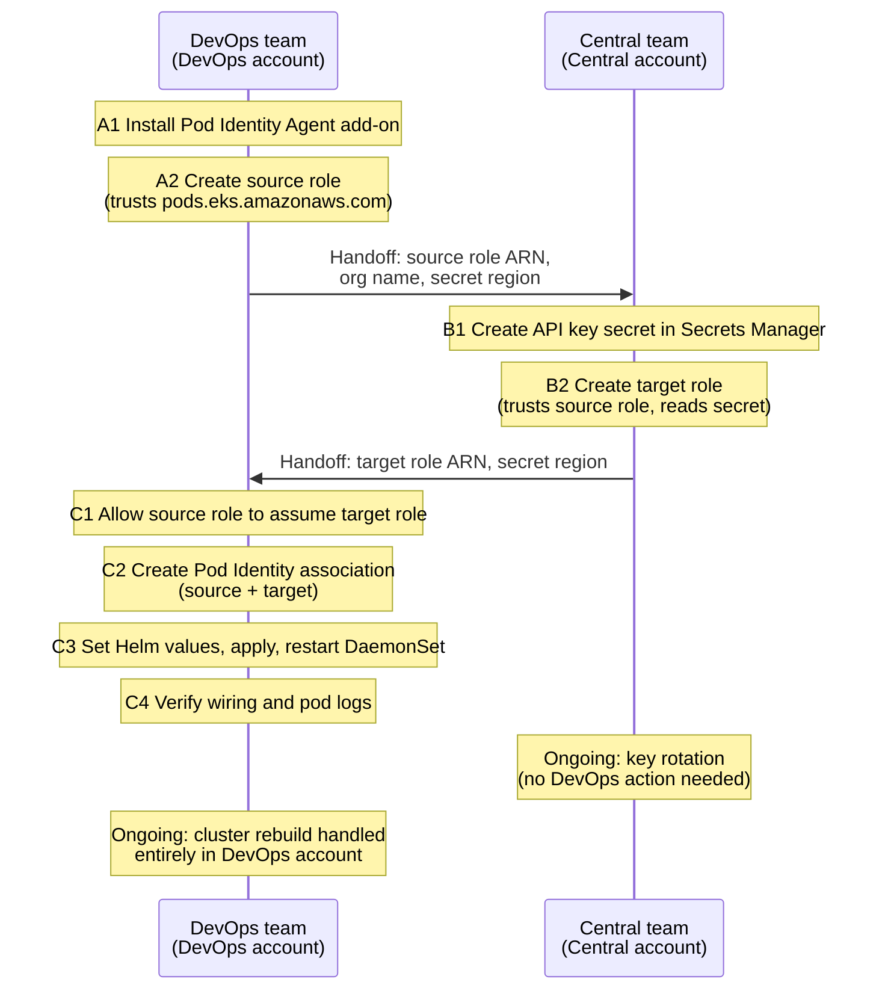

# Kubernetes ARC Harden-Runner: Keyless API Key Setup

This guide describes the one-time setup required to enable keyless mode for
Kubernetes runners (ARC) when the **EKS cluster and the secret live in
different AWS accounts**, and splits the work by team.

In keyless mode, the Harden-Runner agent DaemonSet retrieves its StepSecurity
API key from AWS Secrets Manager and refreshes it periodically, so key
rotation requires no Helm upgrade or pod restart, and no involvement from
the DevOps team.

There are two supported ways for the pod to obtain AWS credentials, each
documented as a self-contained track below:

- **Track 1: IRSA** (IAM Roles for Service Accounts) — the pod presents a
  projected service-account OIDC token and calls
  `AssumeRoleWithWebIdentity`.
- **Track 2: EKS Pod Identity** — the node-local Pod Identity Agent supplies
  credentials, chaining a DevOps source role into a Central target role.

Pick one; do not run both. The tracks are listed in no particular order of
preference — choose based on the constraints in
[Choosing a mechanism](#choosing-a-mechanism).

## Ownership

| Component | Account | Owned by | Track |
| --- | --- | --- | --- |
| EKS cluster + Harden-Runner DaemonSet + Helm release | **DevOps account** (`111111111111` in examples) | DevOps team | both |
| Secrets Manager secret | **Central account** (`222222222222` in examples) | Central team | both |
| OIDC provider registration + IAM role (single role) | **Central account** | Central team | IRSA |
| Pod Identity Agent add-on + source IAM role + Pod Identity association | **DevOps account** | DevOps team | Pod Identity |
| Target IAM role (trusts the source role) | **Central account** | Central team | Pod Identity |

Neither team needs credentials for the other team's account at any point, on
either track.

## How this compares to the VM runner setup

The VM and Kubernetes (ARC) setups share the same AWS access model, differing
only in how the IAM role is assumed. All of them fetch the StepSecurity API
key from AWS Secrets Manager by assuming an IAM role and calling
`GetSecretValue`. On a VM the runner already has AWS credentials and calls
`AssumeRole`. On Kubernetes there is no stored credential, so the pod's
identity is established either by an OIDC token (IRSA) or by the EKS Pod
Identity association.

| AWS dimension | VM self-hosted runner | Kubernetes (ARC), IRSA | Kubernetes (ARC), Pod Identity |
| --- | --- | --- | --- |
| STS operation | `AssumeRole` | `AssumeRoleWithWebIdentity` | `AssumeRoleForPodIdentity` (EKS Auth API), then a chained `AssumeRole` |
| Bootstrap credentials | Runner needs existing AWS credentials (EC2 instance profile, env, and similar) able to call `AssumeRole` | None (keyless). The pod presents its projected service-account OIDC token | None (keyless). The pod presents the injected Pod Identity token to the node-local agent |
| Identity presented to AWS | Runner's IAM principal. The StepSecurity org is passed as an `OrgName` STS session tag | Kubernetes service account (`system:serviceaccount:<namespace>:hardenrunner`) as an OIDC JWT | Pod Identity association (cluster + namespace + service account), forwarded as session tags |
| Role trust policy trusts | Runner's IAM principal | Cluster's OIDC provider, with `sub` and `aud` conditions matching the service account | Source role: `pods.eks.amazonaws.com`. Target role: the source role's ARN |
| OIDC provider | Not used | Cluster issuer registered in the account that holds the role (one time, Part B1) | Not used |
| Roles involved | One | One (in the Central account) | Two (source in DevOps, target in Central) |
| Secret name | `stepsecurity/orgs/<owner>/vm-api-key` | `stepsecurity/orgs/github-orgs/<ORG_NAME>/arc-api-key` | `stepsecurity/orgs/github-orgs/<ORG_NAME>/arc-api-key` |
| Who calls AWS | Pre-job hook, per job (temporary 900s credentials) | Harden-Runner DaemonSet, refreshed periodically, not the hook | Harden-Runner DaemonSet, refreshed periodically, not the hook |
| Cross-account | Possible with the same pattern (role trusts the runner account) | First class: role and secret live in the Central account, cluster in another, trust via OIDC | First class: target role and secret live in the Central account, trust via role-to-role chaining |

The rest of this guide covers the one-time IAM, add-on, and Helm setup that
makes either path work.

## Choosing a mechanism

| Consideration | IRSA (Track 1) | EKS Pod Identity (Track 2) |
| --- | --- | --- |
| Cluster requirements | Any cluster with an OIDC issuer, including EKS Fargate and self-hosted Kubernetes | EKS on EC2 Linux nodes, Kubernetes 1.24+; **not** Fargate, not self-hosted |
| Extra cluster component | None | Pod Identity Agent add-on (must be a version that supports target roles) |
| What Central must know about the cluster | OIDC issuer URL, namespace, service account name | Nothing cluster-specific — only the source role ARN |
| Roles to create | One, in the Central account | Two: source in DevOps, target in Central |
| Kubernetes wiring | Service account annotation `eks.amazonaws.com/role-arn` | Pod Identity association (no annotation) |
| Cluster recreation | Issuer ID changes: Central must re-register the provider and update the trust policy | DevOps-only: reinstall the add-on and recreate the association. Central does nothing |
| Adding clusters | One trust policy statement per cluster, subject to the trust policy size limit (2,048 chars default) | Reuse the same association on each cluster; no IAM change, no size limit |
| Failure surface | Cluster-specific issuer path and `sub`/`aud` conditions | Add-on health and association scoping |

Short version: Pod Identity removes the OIDC provider registration and
survives cluster rebuilds without Central involvement, at the cost of an
add-on dependency, an EKS-on-EC2 requirement, and a second role. IRSA works
on a wider set of clusters and needs no add-on, but ties the Central trust
policy to a cluster-specific issuer.

## Why the credentials must belong to a Central-account role

The agent looks up the secret **by name**
(`stepsecurity/orgs/github-orgs/<ORG_NAME>/arc-api-key`), not by full ARN. A
name-only `GetSecretValue` call resolves in the account of the credentials
making the call. Therefore, on both tracks:

- A role in the DevOps account combined with a resource policy on the Central
  secret **will not work**: the name would resolve in the DevOps account
  and the agent would get `ResourceNotFoundException`.
- The credentials the pod ends up with must belong to a role **in the Central
  account** — reached directly via IRSA's cross-account trust (Track 1), or
  via Pod Identity's target role chaining (Track 2).

Because the role that reads the secret and the secret itself are in the same
account, the default `aws/secretsmanager` KMS key is sufficient on both
tracks. No secret resource policy and no customer-managed KMS key are
required.

## Prerequisites

Shared:

- **Central team:** IAM and Secrets Manager permissions in the Central account.
- Your StepSecurity organization name (referred to as `<ORG_NAME>` below).
- The API key for Kubernetes runners (ARC), provided by StepSecurity. It is held
  by whichever team manages the StepSecurity relationship, and is entered by the
  Central team when the secret is created. StepSecurity issues two keys per
  scenario (a primary and a secondary key); use the primary key here. If you
  also use Harden-Runner on VM runners, that scenario has its own separate key
  pair and secret (`stepsecurity/orgs/github-orgs/<ORG_NAME>/vm-api-key`); the
  keys are not interchangeable between scenarios.
- Ability to upgrade the Harden-Runner Helm release.

Track 1 (IRSA) additionally:

- **DevOps team:** admin access to the EKS cluster and permission to run
  `aws eks describe-cluster` in the DevOps account.
- **Central team:** permission to create an OIDC provider, a role, and a
  secret.

Track 2 (Pod Identity) additionally:

- **DevOps team:** admin access to the EKS cluster (Kubernetes 1.24 or
  later, EC2 Linux nodes), permission to manage EKS add-ons, IAM roles, and
  Pod Identity associations in the DevOps account. The Pod Identity Agent must
  be a version that supports target roles (any current version does; if the
  add-on was installed long ago, update it).
- **Central team:** permission to create a role and a secret.
- The AWS SDK inside the agent must support container credentials with
  authorization tokens (any SDK release from 2024 onward does; current
  Harden-Runner agent images qualify).

---

# Track 1: IRSA

Use this track for clusters that cannot run the Pod Identity Agent (Fargate,
self-hosted Kubernetes), or where an existing IRSA estate makes it the
simpler fit.

## How it works (IRSA)

1. The Harden-Runner agent DaemonSet in the DevOps cluster authenticates to
   AWS using IAM Roles for Service Accounts (IRSA).
2. The DevOps cluster's OIDC issuer is registered as an identity provider in
   the **Central** account's IAM (Part B1). Kubernetes issues each pod a
   short-lived signed JWT for its service account.
3. Because the `hardenrunner` service account is annotated with the Central
   account's role ARN, EKS automatically mounts the token into the DaemonSet
   pods and points the AWS SDK at it. The EKS webhook does not care that the
   ARN belongs to another account.
4. The agent calls STS `AssumeRoleWithWebIdentity`, presenting the token.
   STS verifies the token's signature against the OIDC provider registered
   in the Central account and checks the role's trust policy, which only matches
   `system:serviceaccount:<namespace>:hardenrunner` from this specific
   cluster's issuer.
5. STS returns temporary credentials for the Central role. The role's only
   permission is `secretsmanager:GetSecretValue` on the one API key secret
   in the Central account, so that is all the pod can do with them.
6. On startup, and every few hours after, the agent reads the API key from
   the secret. The refreshed key takes effect immediately, with no restarts.


```mermaid
sequenceDiagram
    participant Pod as Harden-Runner pod (DevOps cluster)<br/>(SA: hardenrunner)
    participant STS as AWS STS
    participant SM as Secrets Manager (Central account)

    Note over Pod: SA token auto-mounted by EKS<br/>at pod startup (projected volume)
    Pod->>STS: AssumeRoleWithWebIdentity<br/>(token + Central role ARN from SA annotation)
    STS->>STS: Verify token against OIDC provider<br/>registered in Central account,<br/>check trust policy sub/aud match
    STS-->>Pod: Temporary credentials<br/>for the Central IAM role
    Pod->>SM: GetSecretValue<br/>(stepsecurity/orgs/github-orgs/<ORG_NAME>/arc-api-key)
    SM-->>Pod: api_key
    Note over Pod: Uses the key for the StepSecurity API,<br/>repeats this fetch every 3 hours
```

## Responsibilities at a glance (IRSA)

| Phase | Task | Team | Account |
| --- | --- | --- | --- |
| A1 | Gather cluster OIDC issuer + SA details, hand off to Central | DevOps | DevOps |
| B1 | Register the cluster's OIDC provider in IAM | Central | Central |
| B2 | Create the API key secret in Secrets Manager | Central | Central |
| B3 | Create the IAM role (trust + permission policy), hand role ARN to DevOps | Central | Central |
| C1 | Update Helm values with the Central role ARN and apply | DevOps | DevOps |
| C2 | Verify wiring and pod logs | DevOps | DevOps (cluster) |
| Ongoing | Key rotation | Central | Central |
| Ongoing | Notify Central on cluster recreation (issuer change) | DevOps | n/a |
| Ongoing | Update provider + trust policy on issuer change | Central | Central |

**Handoffs between teams:**

- DevOps → Central (before Part B): OIDC issuer URL, Kubernetes namespace,
  service account name, StepSecurity org name, desired secret region.
- Central → DevOps (before Part C): IAM role ARN, secret region (if different
  from the cluster's region).


```mermaid
sequenceDiagram
    participant D as DevOps team<br/>(DevOps account)
    participant C as Central team<br/>(Central account)

    Note over D: A1 Gather cluster OIDC issuer,<br/>namespace, SA, org name, region
    D->>C: Handoff: OIDC issuer URL, namespace,<br/>service account, org name, secret region
    Note over C: B1 Register cluster OIDC provider in IAM
    Note over C: B2 Create API key secret in Secrets Manager
    Note over C: B3 Create IAM role<br/>(trust + permission policy)
    C->>D: Handoff: IAM role ARN, secret region
    Note over D: C1 Set Helm values with role ARN, apply
    Note over D: C2 Verify wiring and pod logs

    Note over C: Ongoing: key rotation<br/>(no DevOps action needed)
    D->>C: Ongoing: notify on cluster recreation<br/>(issuer change)
    Note over C: Update OIDC provider + trust policy
```

## Part A (IRSA): DevOps team: gather and hand off cluster details

**Run with DevOps account credentials.**

```bash
export CLUSTER_NAME="<your-eks-cluster>"
export AWS_REGION="<region>"                    # cluster region, e.g. us-east-1

export OIDC_ISSUER=$(aws eks describe-cluster --name "$CLUSTER_NAME" --region "$AWS_REGION" \
  --query 'cluster.identity.oidc.issuer' --output text)
echo "$OIDC_ISSUER"
# e.g. https://oidc.eks.us-east-1.amazonaws.com/id/EXAMPLED539D4633E53DE1B71EXAMPLE
```

Hand the following to the Central team:

| Item | Value |
| --- | --- |
| OIDC issuer URL | output of the command above |
| Namespace | `kube-system` (or wherever the chart is installed) |
| Service account name | `hardenrunner` (or your override via `serviceAccount.name` / `fullnameOverride`) |
| StepSecurity org name | `<ORG_NAME>` |
| Cluster region | `$AWS_REGION` (so Central can create the secret in the same region, or tell you otherwise) |

> No IAM changes are needed in the DevOps account for this setup. The
> cluster's OIDC provider does **not** need to be registered in the DevOps
> account's IAM for this role to work (though it commonly already is if
> other IRSA roles exist there).

## Part B (IRSA): Central team: provider, secret, and role

**All commands in this part run with Central account credentials.** Set the
variables from the DevOps handoff first:

```bash
export OIDC_ISSUER="<issuer URL from DevOps>"
export OIDC_PROVIDER="${OIDC_ISSUER#https://}"
export NAMESPACE="kube-system"
export SERVICE_ACCOUNT="hardenrunner"
export ORG_NAME="<github-org>"
export SECRET_REGION="<region>"                 # usually the cluster's region
export ROLE_NAME="StepSecurityHardenRunnerSecretReader"
export SEC_ACCOUNT_ID=$(aws sts get-caller-identity --query Account --output text)
export DEVOPS_ACCOUNT_ID="111111111111"         # for the role description only
```

### B1: Register the cluster's OIDC provider

The issuer URL is public; registering it makes the Central account willing to
verify tokens issued by that cluster.

Check whether it is already registered:

```bash
aws iam list-open-id-connect-providers | grep "$OIDC_PROVIDER" \
  || echo "No OIDC provider in Central account - register one (below)"
```

If missing, register it (one-time per cluster, per account):

```bash
aws iam create-open-id-connect-provider \
  --url "$OIDC_ISSUER" \
  --client-id-list sts.amazonaws.com \
  --thumbprint-list 9e99a48a9960b14926bb7f3b02e22da2b0ab7280
```

(The thumbprint argument is required by the API but unused for EKS issuers;
AWS pins the root CA for EKS OIDC endpoints.)

> **Note:** `eksctl utils associate-iam-oidc-provider` cannot be used here;
> it registers the provider in the cluster's own account. For the Central
> account, use the raw `aws iam create-open-id-connect-provider` call above.

### B2: Create the secret in Secrets Manager

The secret lives in `SECRET_REGION`, with this exact name:
`stepsecurity/orgs/github-orgs/<ORG_NAME>/arc-api-key`. The value must be a
JSON object containing the API key: `{"api_key": "..."}`.

```bash
export SECRET_NAME="stepsecurity/orgs/github-orgs/${ORG_NAME}/arc-api-key"

# Prompt for the key so it never lands in shell history:
read -r -s -p "StepSecurity API key: " STEPSECURITY_API_KEY; echo

aws secretsmanager create-secret \
  --name "$SECRET_NAME" \
  --description "StepSecurity ARC Harden-Runner API key for ${ORG_NAME} (keyless mode, cross-account)" \
  --secret-string "{\"api_key\": \"${STEPSECURITY_API_KEY}\"}" \
  --region "$SECRET_REGION"

export SECRET_ARN=$(aws secretsmanager describe-secret --secret-id "$SECRET_NAME" \
  --region "$SECRET_REGION" --query 'ARN' --output text)
echo "$SECRET_ARN"
```

If the secret already exists, update its value instead:

```bash
aws secretsmanager put-secret-value \
  --secret-id "$SECRET_NAME" \
  --secret-string "{\"api_key\": \"${STEPSECURITY_API_KEY}\"}" \
  --region "$SECRET_REGION"
```

Because the role that reads this secret also lives in the Central account (B3),
the default `aws/secretsmanager` KMS key is sufficient. No secret resource
policy and no customer-managed KMS key are needed.

### B3: Create the IAM role (cross-account IRSA trust)

The role needs only one permission: read access to the secret created above.
The trust policy restricts it to the Harden-Runner service account in the
DevOps cluster.

**B3a. Create the role with its trust policy.** Two things differ from a
same-account IRSA trust policy: the `Federated` principal uses the **Central**
account ID (that is where the provider from B1 lives), while the condition
keys still use the **DevOps cluster's** issuer path:

```bash
cat > /tmp/harden-runner-trust.json <<EOF
{
  "Version": "2012-10-17",
  "Statement": [
    {
      "Effect": "Allow",
      "Principal": {
        "Federated": "arn:aws:iam::${SEC_ACCOUNT_ID}:oidc-provider/${OIDC_PROVIDER}"
      },
      "Action": "sts:AssumeRoleWithWebIdentity",
      "Condition": {
        "StringEquals": {
          "${OIDC_PROVIDER}:sub": "system:serviceaccount:${NAMESPACE}:${SERVICE_ACCOUNT}",
          "${OIDC_PROVIDER}:aud": "sts.amazonaws.com"
        }
      }
    }
  ]
}
EOF

aws iam create-role \
  --role-name "$ROLE_NAME" \
  --description "Cross-account IRSA role for ARC Harden-Runner keyless API key retrieval (cluster in ${DEVOPS_ACCOUNT_ID})" \
  --assume-role-policy-document file:///tmp/harden-runner-trust.json
```

(If the role already exists, use `aws iam update-assume-role-policy
--role-name "$ROLE_NAME" --policy-document
file:///tmp/harden-runner-trust.json` instead.)

**B3b. Attach the permission policy (read exactly this one secret):**

```bash
cat > /tmp/harden-runner-permission.json <<EOF
{
  "Version": "2012-10-17",
  "Statement": [
    {
      "Effect": "Allow",
      "Action": "secretsmanager:GetSecretValue",
      "Resource": "${SECRET_ARN}"
    }
  ]
}
EOF

aws iam put-role-policy \
  --role-name "$ROLE_NAME" \
  --policy-name "StepSecurityKeylessSecretRead" \
  --policy-document file:///tmp/harden-runner-permission.json

rm /tmp/harden-runner-trust.json /tmp/harden-runner-permission.json
```

**B3c. Capture the role ARN and hand it to the DevOps team:**

```bash
export ROLE_ARN=$(aws iam get-role --role-name "$ROLE_NAME" --query 'Role.Arn' --output text)
echo "$ROLE_ARN"
# e.g. arn:aws:iam::222222222222:role/StepSecurityHardenRunnerSecretReader
```

Hand to the DevOps team: the **role ARN**, and the **secret region** if it
differs from the cluster's region.

## Part C (IRSA): DevOps team: Helm values and verification

**Run against the DevOps cluster.** No AWS IAM permissions needed for this
part.

### C1: Helm values

Add the following to your Harden-Runner Helm values. The service account
annotation points at the **Central** account's role ARN; the EKS webhook mounts
the token and sets `AWS_ROLE_ARN` regardless of which account the ARN
belongs to.

```yaml
env:
  orgName: "<ORG_NAME>"
  keyless:
    enabled: "true"
    # Required if the secret's region (from the Central handoff) differs from
    # the cluster's region. Leave unset if they are the same.
    # region: "us-east-1"

serviceAccount:
  annotations:
    eks.amazonaws.com/role-arn: "<ROLE_ARN from the Central team>"
```

With keyless mode enabled, the `apiKey` and `apiKeySecretName` values are
ignored and can be removed.

Apply the change:

```bash
helm upgrade arc-harden-runner <chart> -f values.yaml -n kube-system
```

### C2: Verify

First confirm the IRSA wiring: the service account carries the Central role
annotation, and EKS injected the AWS credentials into the pods.

```bash
export NAMESPACE="kube-system"
export SERVICE_ACCOUNT="hardenrunner"

kubectl -n "$NAMESPACE" get sa "$SERVICE_ACCOUNT" \
  -o jsonpath='{.metadata.annotations.eks\.amazonaws\.com/role-arn}'; echo

kubectl -n "$NAMESPACE" get pod -l app=arc-harden-runner \
  -o jsonpath='{.items[0].spec.containers[0].env[?(@.name=="AWS_ROLE_ARN")].value}'; echo
```

Both should print the Central role ARN. If the second one is empty, the pods
predate the annotation; restart them
(`kubectl -n "$NAMESPACE" rollout restart daemonset -l app=arc-harden-runner`),
since the credentials are injected only at pod creation.

Then check the Harden-Runner pod logs after rollout:

```bash
kubectl -n kube-system logs -l app=arc-harden-runner --tail=50
```

A successful startup fetches the key before monitoring begins. If the pod
cannot read the secret, the logs will show the error and the pod will keep
retrying until access is fixed.

## Troubleshooting (IRSA)

The "fix owner" column tells you which team's side the problem is on.

| Symptom in logs | Likely cause | Fix owner |
| --- | --- | --- |
| `InvalidIdentityToken` / `No OpenIDConnect provider found in your account` | OIDC provider not registered in the Central account (B1 skipped, or run against the wrong account) | Central |
| `AccessDenied` on `AssumeRoleWithWebIdentity` | Trust policy `Federated` ARN uses the DevOps account ID instead of Central's, issuer path typo, or `sub` doesn't match the namespace/service account | Central (values from DevOps handoff) |
| `AccessDeniedException` on `GetSecretValue` | Central role missing `secretsmanager:GetSecretValue` on the secret ARN | Central |
| `ResourceNotFoundException` | Secret name doesn't match `stepsecurity/orgs/github-orgs/<ORG_NAME>/arc-api-key`; secret in a different region than the agent queries (`env.keyless.region` unset or wrong); or the secret was created in the DevOps account instead of Central | Central (name/region) or DevOps (`env.keyless.region`) |
| `orgName is required` | `env.orgName` not set in Helm values | DevOps |
| No AWS credentials | Service account annotation missing, or pods not restarted after annotating | DevOps |

The Central team can also confirm end-to-end identity from its side: CloudTrail
in the Central account records the `AssumeRoleWithWebIdentity` calls, including
the `sub` claim (`system:serviceaccount:kube-system:hardenrunner`), and the
subsequent `GetSecretValue` calls under the role session. The Central
account retains full visibility into which workload reads the key.

---

# Track 2: EKS Pod Identity

Use this track on EKS clusters with EC2 Linux nodes when you want to keep the
cluster's OIDC issuer out of the Central account and make cluster rebuilds a
DevOps-only operation.

## How the two-role design works

As explained in
[Why the credentials must belong to a Central-account role](#why-the-credentials-must-belong-to-a-central-account-role),
the credentials the pod ends up with must belong to a role in the Central
account. EKS Pod Identity supports this natively through the association's
**target role** feature:

- A **source role** lives in the DevOps account. Its trust policy trusts
  `pods.eks.amazonaws.com`; its only permission is to assume the target
  role.
- A **target role** lives in the Central account. Its trust policy trusts the
  source role; its only permission is `secretsmanager:GetSecretValue` on
  the one API key secret.
- The Pod Identity association is created with both ARNs
  (`--role-arn` = source, `--target-role-arn` = target). EKS performs the
  role chaining automatically and delivers **target role credentials** to
  the pod. The application (and the Harden-Runner chart) needs no awareness
  of the chaining, and the name-based secret lookup resolves in the Central
  account as required.

## How it works end to end (Pod Identity)

1. The Pod Identity Agent add-on runs as a DaemonSet on the cluster's nodes
   and exposes a local credentials endpoint.
2. The Harden-Runner service account has a Pod Identity association mapping
   it to the source role, with the Central target role set on the association.
   No service account annotation is used.
3. When a Harden-Runner pod starts, EKS injects
   `AWS_CONTAINER_CREDENTIALS_FULL_URI` and
   `AWS_CONTAINER_AUTHORIZATION_TOKEN_FILE` into its containers. The AWS
   SDK's default credential chain uses these automatically.
4. The SDK requests credentials from the local agent. The agent calls the
   EKS Auth API (`AssumeRoleForPodIdentity`), which validates the
   association, assumes the source role, chains to the Central target role, and
   returns target role credentials. Sessions are tagged with the cluster
   name, namespace, and service account name.
5. The agent hands the credentials to the SDK, which caches and refreshes
   them before expiry.
6. On startup, and every few hours after, the agent reads the API key from
   the secret in the Central account. The refreshed key takes effect
   immediately, with no restarts.


```mermaid
sequenceDiagram
    participant Pod as Harden-Runner pod (DevOps cluster)<br/>(SA: hardenrunner)
    participant Agent as Pod Identity Agent<br/>(node-local)
    participant Auth as EKS Auth API
    participant SM as Secrets Manager (Central account)

    Note over Pod: EKS injects credential endpoint<br/>env vars + token at pod startup
    Pod->>Agent: Credential request (token)
    Agent->>Auth: AssumeRoleForPodIdentity
    Auth->>Auth: Validate association,<br/>assume source role (DevOps),<br/>chain to target role (Central)
    Auth-->>Agent: Temporary credentials<br/>for the Central target role
    Agent-->>Pod: Credentials to SDK
    Pod->>SM: GetSecretValue<br/>(stepsecurity/orgs/github-orgs/<ORG_NAME>/arc-api-key)
    SM-->>Pod: api_key
    Note over Pod: Uses the key for the StepSecurity API,<br/>repeats this fetch every 3 hours
```

## Responsibilities at a glance (Pod Identity)

| Phase | Task | Team | Account |
| --- | --- | --- | --- |
| A1 | Install the Pod Identity Agent add-on | DevOps | DevOps |
| A2 | Create the source role, hand its ARN to Central | DevOps | DevOps |
| B1 | Create the API key secret in Secrets Manager | Central | Central |
| B2 | Create the target role trusting the source role, hand its ARN to DevOps | Central | Central |
| C1 | Attach the assume-target permission to the source role | DevOps | DevOps |
| C2 | Create the Pod Identity association (source + target) | DevOps | DevOps |
| C3 | Update Helm values and apply | DevOps | DevOps |
| C4 | Verify wiring and pod logs | DevOps | DevOps (cluster) |
| Ongoing | Key rotation | Central | Central |
| Ongoing | Cluster recreation: recreate add-on + association | DevOps | DevOps |

**Handoffs between teams:**

- DevOps → Central (before Part B): source role ARN, StepSecurity org name,
  desired secret region.
- Central → DevOps (before Part C): target role ARN, secret region (if
  different from the cluster's region).

Unlike the IRSA track, the Central team needs no cluster-specific
information at all.


```mermaid
sequenceDiagram
    participant D as DevOps team<br/>(DevOps account)
    participant C as Central team<br/>(Central account)

    Note over D: A1 Install Pod Identity Agent add-on
    Note over D: A2 Create source role<br/>(trusts pods.eks.amazonaws.com)
    D->>C: Handoff: source role ARN,<br/>org name, secret region
    Note over C: B1 Create API key secret in Secrets Manager
    Note over C: B2 Create target role<br/>(trusts source role, reads secret)
    C->>D: Handoff: target role ARN, secret region
    Note over D: C1 Allow source role to assume target role
    Note over D: C2 Create Pod Identity association<br/>(source + target)
    Note over D: C3 Set Helm values, apply, restart DaemonSet
    Note over D: C4 Verify wiring and pod logs

    Note over C: Ongoing: key rotation<br/>(no DevOps action needed)
    Note over D: Ongoing: cluster rebuild handled<br/>entirely in DevOps account
```

## Part A (Pod Identity): DevOps team: agent add-on and source role

**All commands in this part run with DevOps account credentials.**

```bash
export CLUSTER_NAME="<your-eks-cluster>"
export AWS_REGION="<region>"                    # cluster region, e.g. us-east-1
export NAMESPACE="kube-system"                  # namespace where Harden-Runner is installed
export SERVICE_ACCOUNT="hardenrunner"           # default chart service account name
export SOURCE_ROLE_NAME="StepSecurityHardenRunnerPodIdentity"
export DEVOPS_ACCOUNT_ID=$(aws sts get-caller-identity --query Account --output text)
```

### A1: Install the Pod Identity Agent add-on

Check whether it is already installed:

```bash
aws eks describe-addon --cluster-name "$CLUSTER_NAME" --region "$AWS_REGION" \
  --addon-name eks-pod-identity-agent \
  --query 'addon.{status:status,version:addonVersion}' 2>/dev/null \
  || echo "Add-on not installed - install it (below)"
```

If missing, install it (one-time per cluster):

```bash
aws eks create-addon \
  --cluster-name "$CLUSTER_NAME" \
  --region "$AWS_REGION" \
  --addon-name eks-pod-identity-agent
```

Wait until the add-on status is `ACTIVE` before continuing to C4
verification later (the association in C2 can be created regardless).

### A2: Create the source role

The source role's trust policy trusts the EKS Pod Identity service
principal. It is generic: no cluster ID, no OIDC issuer, no namespace. The
namespace and service account scoping happens on the association in C2, and
the `Condition` block below optionally pins the role to this cluster.

```bash
cat > /tmp/harden-runner-source-trust.json <<EOF
{
  "Version": "2012-10-17",
  "Statement": [
    {
      "Effect": "Allow",
      "Principal": {
        "Service": "pods.eks.amazonaws.com"
      },
      "Action": [
        "sts:AssumeRole",
        "sts:TagSession"
      ],
      "Condition": {
        "StringEquals": {
          "aws:SourceAccount": "${DEVOPS_ACCOUNT_ID}"
        }
      }
    }
  ]
}
EOF

aws iam create-role \
  --role-name "$SOURCE_ROLE_NAME" \
  --description "Pod Identity source role for ARC Harden-Runner keyless mode (chains to Central target role)" \
  --assume-role-policy-document file:///tmp/harden-runner-source-trust.json

rm /tmp/harden-runner-source-trust.json

export SOURCE_ROLE_ARN=$(aws iam get-role --role-name "$SOURCE_ROLE_NAME" \
  --query 'Role.Arn' --output text)
echo "$SOURCE_ROLE_ARN"
# e.g. arn:aws:iam::111111111111:role/StepSecurityHardenRunnerPodIdentity
```

The source role gets its permission policy in C1, after the Central team
provides the target role ARN. It needs no other permissions.

Hand the following to the Central team:

| Item | Value |
| --- | --- |
| Source role ARN | output of the command above |
| StepSecurity org name | `<ORG_NAME>` |
| Cluster region | `$AWS_REGION` (so Central can create the secret in the same region, or tell you otherwise) |

Note what is **not** in this handoff compared to the IRSA track: no OIDC
issuer URL, no namespace, no service account name. The Central team's trust
decision is "this specific role in the DevOps account", and the DevOps team
controls which workload gets that role via the association.

## Part B (Pod Identity): Central team: secret and target role

**All commands in this part run with Central account credentials.** Set the
variables from the DevOps handoff first:

```bash
export SOURCE_ROLE_ARN="<source role ARN from DevOps>"
export ORG_NAME="<github-org>"
export SECRET_REGION="<region>"                 # usually the cluster's region
export TARGET_ROLE_NAME="StepSecurityHardenRunnerSecretReader"
```

### B1: Create the secret in Secrets Manager

The secret lives in `SECRET_REGION`, with this exact name:
`stepsecurity/orgs/github-orgs/<ORG_NAME>/arc-api-key`. The value must be a
JSON object containing the API key: `{"api_key": "..."}`.

```bash
export SECRET_NAME="stepsecurity/orgs/github-orgs/${ORG_NAME}/arc-api-key"

# Prompt for the key so it never lands in shell history:
read -r -s -p "StepSecurity API key: " STEPSECURITY_API_KEY; echo

aws secretsmanager create-secret \
  --name "$SECRET_NAME" \
  --description "StepSecurity ARC Harden-Runner API key for ${ORG_NAME} (keyless mode, cross-account, Pod Identity)" \
  --secret-string "{\"api_key\": \"${STEPSECURITY_API_KEY}\"}" \
  --region "$SECRET_REGION"

export SECRET_ARN=$(aws secretsmanager describe-secret --secret-id "$SECRET_NAME" \
  --region "$SECRET_REGION" --query 'ARN' --output text)
echo "$SECRET_ARN"
```

If the secret already exists, update its value instead:

```bash
aws secretsmanager put-secret-value \
  --secret-id "$SECRET_NAME" \
  --secret-string "{\"api_key\": \"${STEPSECURITY_API_KEY}\"}" \
  --region "$SECRET_REGION"
```

### B2: Create the target role

The target role's trust policy trusts the DevOps source role. Its only
permission is read access to the secret created above.

**B2a. Create the role with its trust policy:**

```bash
cat > /tmp/harden-runner-target-trust.json <<EOF
{
  "Version": "2012-10-17",
  "Statement": [
    {
      "Effect": "Allow",
      "Principal": {
        "AWS": "${SOURCE_ROLE_ARN}"
      },
      "Action": [
        "sts:AssumeRole",
        "sts:TagSession"
      ]
    }
  ]
}
EOF

aws iam create-role \
  --role-name "$TARGET_ROLE_NAME" \
  --description "Target role for ARC Harden-Runner keyless mode; assumed via Pod Identity chaining from the DevOps account" \
  --assume-role-policy-document file:///tmp/harden-runner-target-trust.json

rm /tmp/harden-runner-target-trust.json
```

`sts:TagSession` is required because EKS Pod Identity forwards session tags
(cluster name, namespace, service account name) through the chained
session. Do not omit it.

(If the role already exists, use `aws iam update-assume-role-policy
--role-name "$TARGET_ROLE_NAME" --policy-document
file:///tmp/harden-runner-target-trust.json` instead.)

**B2b. Attach the permission policy (read exactly this one secret):**

```bash
cat > /tmp/harden-runner-target-permission.json <<EOF
{
  "Version": "2012-10-17",
  "Statement": [
    {
      "Effect": "Allow",
      "Action": "secretsmanager:GetSecretValue",
      "Resource": "${SECRET_ARN}"
    }
  ]
}
EOF

aws iam put-role-policy \
  --role-name "$TARGET_ROLE_NAME" \
  --policy-name "StepSecurityKeylessSecretRead" \
  --policy-document file:///tmp/harden-runner-target-permission.json

rm /tmp/harden-runner-target-permission.json
```

**B2c. Capture the target role ARN and hand it to the DevOps team:**

```bash
export TARGET_ROLE_ARN=$(aws iam get-role --role-name "$TARGET_ROLE_NAME" \
  --query 'Role.Arn' --output text)
echo "$TARGET_ROLE_ARN"
# e.g. arn:aws:iam::222222222222:role/StepSecurityHardenRunnerSecretReader
```

Hand to the DevOps team: the **target role ARN**, and the **secret region**
if it differs from the cluster's region.

## Part C (Pod Identity): DevOps team: permission, association, Helm, verification

**All commands run with DevOps account credentials** (and `kubectl` against
the cluster). Set the value from the Central handoff:

```bash
export TARGET_ROLE_ARN="<target role ARN from Central>"
```

### C1: Allow the source role to assume the target role

```bash
cat > /tmp/harden-runner-source-permission.json <<EOF
{
  "Version": "2012-10-17",
  "Statement": [
    {
      "Effect": "Allow",
      "Action": [
        "sts:AssumeRole",
        "sts:TagSession"
      ],
      "Resource": "${TARGET_ROLE_ARN}"
    }
  ]
}
EOF

aws iam put-role-policy \
  --role-name "$SOURCE_ROLE_NAME" \
  --policy-name "AssumeCentralTargetRole" \
  --policy-document file:///tmp/harden-runner-source-permission.json

rm /tmp/harden-runner-source-permission.json
```

### C2: Create the Pod Identity association

This replaces the service account annotation used by IRSA. The association
scopes the mapping to the exact cluster, namespace, and service account:

```bash
aws eks create-pod-identity-association \
  --cluster-name "$CLUSTER_NAME" \
  --region "$AWS_REGION" \
  --namespace "$NAMESPACE" \
  --service-account "$SERVICE_ACCOUNT" \
  --role-arn "$SOURCE_ROLE_ARN" \
  --target-role-arn "$TARGET_ROLE_ARN"
```

Confirm it:

```bash
aws eks list-pod-identity-associations \
  --cluster-name "$CLUSTER_NAME" --region "$AWS_REGION" \
  --namespace "$NAMESPACE" --service-account "$SERVICE_ACCOUNT"
```

### C3: Helm values

Add the following to your Harden-Runner Helm values. Unlike the IRSA
track, **no service account annotation is needed**; if you are migrating
from IRSA, remove the `eks.amazonaws.com/role-arn` annotation so there is
no ambiguity about which mechanism is in use.

```yaml
env:
  orgName: "<ORG_NAME>"
  keyless:
    enabled: "true"
    # Required if the secret's region (from the Central handoff) differs from
    # the cluster's region. Leave unset if they are the same.
    # region: "us-east-1"
```

With keyless mode enabled, the `apiKey` and `apiKeySecretName` values are
ignored and can be removed.

Apply the change, then restart the DaemonSet so the pods are recreated with
the Pod Identity environment injected (injection happens only at pod
creation):

```bash
helm upgrade arc-harden-runner <chart> -f values.yaml -n kube-system
kubectl -n "$NAMESPACE" rollout restart daemonset -l app=arc-harden-runner
```

### C4: Verify

Confirm the Pod Identity wiring. With Pod Identity, the injected variable is
the container credentials endpoint, not `AWS_ROLE_ARN`:

```bash
kubectl -n "$NAMESPACE" get pod -l app=arc-harden-runner \
  -o jsonpath='{.items[0].spec.containers[0].env[?(@.name=="AWS_CONTAINER_CREDENTIALS_FULL_URI")].value}'; echo
```

This should print the agent's link-local URI (host `169.254.170.23`). If it
is empty, check that the add-on is `ACTIVE`, the association exists for this
exact namespace and service account, and the pods were restarted after the
association was created.

Then check the Harden-Runner pod logs:

```bash
kubectl -n kube-system logs -l app=arc-harden-runner --tail=50
```

A successful startup fetches the key before monitoring begins. If the pod
cannot read the secret, the logs will show the error and the pod will keep
retrying until access is fixed.

## Troubleshooting (Pod Identity)

The "fix owner" column tells you which team's side the problem is on.

| Symptom | Likely cause | Fix owner |
| --- | --- | --- |
| No AWS credentials / SDK falls back to node role | Add-on not installed or not `ACTIVE`; association missing or created for a different namespace/service account; pods not restarted after the association was created | DevOps |
| `AccessDenied` when EKS assumes the source role | Source role trust policy missing `pods.eks.amazonaws.com`, or missing `sts:TagSession` | DevOps |
| `AccessDenied` on the chained assume into the target role | Source role missing the C1 permission policy; target role trust policy does not list the source role ARN; `sts:TagSession` missing on either side | DevOps (C1) or Central (B2a) |
| `AccessDeniedException` on `GetSecretValue` | Target role missing `secretsmanager:GetSecretValue` on the secret ARN | Central |
| `ResourceNotFoundException` | Secret name doesn't match `stepsecurity/orgs/github-orgs/<ORG_NAME>/arc-api-key`; secret in a different region than the agent queries (`env.keyless.region` unset or wrong); or the secret was created in the DevOps account instead of Central | Central (name/region) or DevOps (`env.keyless.region`) |
| `orgName is required` | `env.orgName` not set in Helm values | DevOps |
| Association create fails with target-role error | Pod Identity Agent add-on too old for target roles; update the add-on | DevOps |

Visibility for the Central team: CloudTrail in the Central account records the
chained `AssumeRole` calls into the target role, with session tags carrying
the cluster name, namespace, and service account name, plus the subsequent
`GetSecretValue` calls under the role session. The Central account retains
full visibility into which workload reads the key. The Central team can also
write the target role's permission policy against these session tags
(`aws:PrincipalTag/eks-cluster-name` and similar) for attribute-based
scoping if it later serves multiple clusters.

---

# Ongoing operations

## Key rotation (Central team) — both tracks

Key rotation is unchanged from the same-account flow (see
`key-rotation-flow-generic.md` in the repository) and is performed entirely
in the Central account (`put-secret-value` on the secret). It needs no Helm
changes, no pod restarts, and no DevOps involvement; the DaemonSet picks up
the new key at its next refresh.

## Cluster recreation

**IRSA (DevOps notifies, Central updates).** If the DevOps cluster is ever
rebuilt, its OIDC issuer ID changes and the trust breaks: pods will log STS
errors and keep retrying.

- **DevOps team:** treat "cluster recreated" as an event that must be
  communicated to the Central team, including the new issuer URL (re-run
  Part A).
- **Central team:** register the new issuer (B1) and update the role's trust
  policy with the new issuer path (B3a, using
  `aws iam update-assume-role-policy`). The old provider registration can
  be deleted once no roles reference it.

Codify both accounts' pieces in IaC (Terraform/CloudFormation) so a cluster
rebuild updates the Central-side resources automatically instead of relying on
a manual handoff.

**Pod Identity (DevOps only).** IAM trust is based on the
`pods.eks.amazonaws.com` service principal and a role-to-role trust, not on a
cluster-specific issuer ID, so a rebuild does not break it:

- **DevOps team:** reinstall the Pod Identity Agent add-on (A1) and recreate
  the association (C2) on the new cluster. Both are inside the DevOps
  account.
- **Central team:** nothing. The source role ARN is unchanged, so the target
  role's trust policy and the secret are unaffected.

## Adding more clusters

**IRSA (joint).** To let the same Central role serve Harden-Runner in
additional DevOps clusters (or additional accounts):

- **DevOps team:** provide the new cluster's issuer URL, namespace, and
  service account name (Part A).
- **Central team:** register each new issuer (B1) and add one statement per
  cluster to the role's trust policy (B3a). Watch the trust policy size
  limit (2,048 characters by default, raisable to 4,096 via Service
  Quotas).

**Pod Identity (DevOps only, with Central awareness).**

- **DevOps team:** install the add-on and create an identical association
  (same source and target role ARNs) on each new cluster. No IAM changes
  are required anywhere, and there is no trust policy size limit to manage.
- **Central team:** no action, but be aware that the trust decision in B2a
  covers every cluster the DevOps team associates the source role with. If
  the Central team wants per-cluster control, it can condition the target
  role's permission policy on the `eks-cluster-name` session tag, or
  require a separate source role per cluster.

Clusters in **additional DevOps accounts** need one addition on the Central
side: either a statement per source role in the target role's trust policy,
or a separate target role per account.

## Least privilege summary

**IRSA.** Nothing in the DevOps account can read the secret except pods
running as `system:serviceaccount:<namespace>:hardenrunner` in the registered
cluster(s), and the role they receive can only call `GetSecretValue` on
this one secret.

**Pod Identity.** Nothing in the DevOps account can obtain Central credentials
except pods running as the associated service account in an associated
cluster: the source role can only be assumed by EKS Pod Identity on behalf of
those pods, and its only permission is to assume the target role. The target
role can only be assumed by the source role, and its only permission is
`GetSecretValue` on this one secret.

On both tracks, the API key itself never appears in Helm values, shell
history, or the DevOps account.
