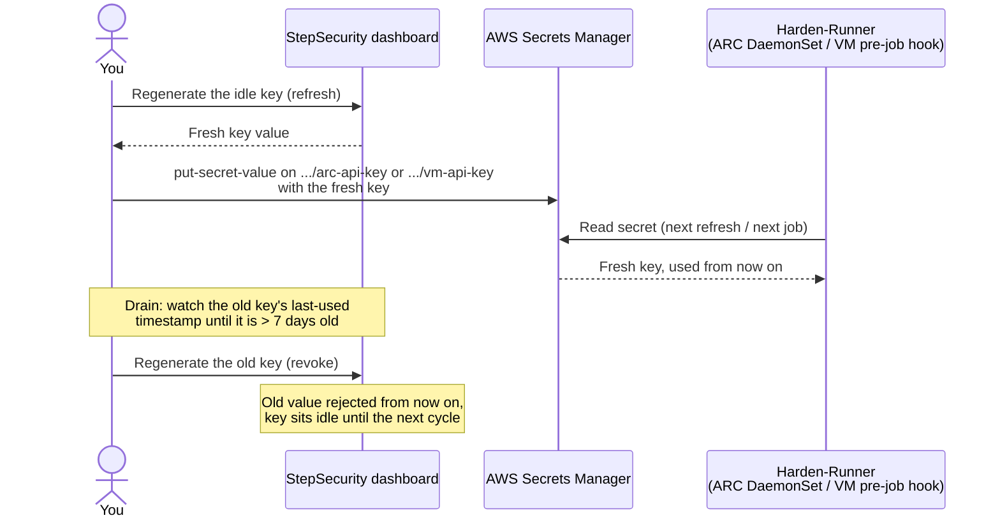

# StepSecurity API Key Rotation

This guide describes how to rotate your StepSecurity API keys on a regular
schedule without any downtime. It applies to both Harden-Runner deployment
scenarios: **VM runners** and **Kubernetes runners (ARC)**. The rotation
procedure is identical for both; only the way the key reaches the agent
differs:

- **VM runners**: the pre-job hook reads the key from the secret and feeds
  it to the agent via its JSON configuration on every job.
- **Kubernetes runners (ARC)**: the agent DaemonSet fetches the key directly
  from the secret using IRSA (IAM Roles for Service Accounts), and refreshes
  it periodically.

In both cases the key lives in AWS Secrets Manager in your account, under
the same naming scheme; only the suffix differs per scenario:

- Kubernetes runners (ARC): `stepsecurity/orgs/github-orgs/<ORG_NAME>/arc-api-key`
- VM runners: `stepsecurity/orgs/github-orgs/<ORG_NAME>/vm-api-key`

Rotating means updating that stored value. No agent or runner changes are
needed.

## The dual-key model

Each deployment scenario is issued **two** API keys: a **primary key** and a
**secondary key**. The key pairs are separate per scenario: VM runners have
their own primary and secondary keys, and Kubernetes runners (ARC) have
their own primary and secondary keys. A VM key cannot be used for the ARC
DaemonSet, and vice versa. Within a scenario, the two keys are
interchangeable: the installation works identically with either one. A key
stays valid until it is regenerated; regenerating it immediately revokes its
previous value.

Two keys exist for one reason: **zero-downtime rotation**. With a single
key, rotating would mean a window where the old key is revoked but the new
key has not yet propagated to every running workload. During that window,
requests to StepSecurity would fail. With two keys, you switch traffic to
the idle key first, confirm the old key is no longer in use, and only
then regenerate it. At no point is the key in use ever invalid.

Within each scenario, the two keys alternate roles over time:

```
   Secret contains:   PRIMARY ──────────► SECONDARY ──────────► PRIMARY' ─────► ...
                      │◄─── ~90 days ───►│◄─── ~90 days ─────►│
   Revoked:                     (primary, after   (secondary, after
                                 1 week unused)    1 week unused)
```

## Rotation schedule

We recommend rotating every **90 days**. A rotation is simple at heart:
**move to the other key, then invalidate the one you left behind.** Say the
primary key is the one in use and the secondary has been sitting idle since
the last rotation. The cycle is:

1. **Refresh**: regenerate the secondary key in the StepSecurity dashboard.
   Its value is about 90 days old by now, so you want a fresh one before
   using it. Nothing is using the secondary, so nothing breaks.
2. **Switch**: put the fresh secondary key into the secret in AWS Secrets
   Manager. Your installation picks it up and starts using it automatically.
   The command is the same for both scenarios; only the secret name suffix
   (`/arc-api-key` or `/vm-api-key`) differs.
3. **Drain**: wait until the primary key has gone unused for **at least one
   week**.
4. **Revoke**: regenerate the primary key. Its old value stops working
   immediately; this is what actually retires it. The primary then sits idle
   until the next rotation, when it starts at step 1 and comes back as the
   key in use.

Each rotation, the two keys trade places. The rule behind the four steps:
a key is regenerated **right before it goes into use** (so the value in use
is never more than ~90 days old) and **right after it is retired** (so a
retired value can never be used again).

Because the VM and Kubernetes key pairs are independent, each scenario is
rotated separately. If you run both, perform the cycle for each pair (the
schedules can run in parallel).

The cycle as a sequence, showing who talks to what:



### Your first rotation

When you first adopt this process, both keys are already aged: they were
issued at your initial onboarding and will typically be 90 days old or
older. That includes the secondary key, even though it has never been used.
No special handling is needed, because the standard cycle already
regenerates the idle key before switching to it. Just start your first
cycle immediately instead of waiting 90 days; your regular schedule starts
from that first switch.

### Why wait a week before revoking?

The ARC DaemonSet refreshes the key from the secret on an interval, and VM
runners read it at the start of every job, so both pick up the new key
within hours of the switch. The one-week drain window is a deliberately
generous safety margin: it covers agents on longer refresh intervals, paused
or scaled-down environments that come back later, and any other place the
old key may still be configured (for example, a second cluster or an
installation where the key is set statically). If the old key shows recent
usage past the switch, something is still using it. Track that down before
regenerating, because regeneration immediately invalidates the old value.

The **last used** timestamp for each key is shown in the StepSecurity
dashboard next to the key. A key is safe to regenerate when its last-used
timestamp is more than 7 days old.

## Step-by-step: rotating from primary to secondary

Assume the secret currently contains the **primary** key of the scenario you
are rotating.

**1. Regenerate the secondary key** for that scenario in the StepSecurity
dashboard, and note the fresh value. The secondary has been idle since the
last cycle (or since onboarding), so its previous value is stale;
regenerating it revokes nothing in use.

**2. Update the secret** in AWS Secrets Manager with the fresh secondary
key. Use the `/arc-api-key` name for Kubernetes runners and the
`/vm-api-key` name for VM runners:

```bash
aws secretsmanager put-secret-value \
  --secret-id "stepsecurity/orgs/github-orgs/<ORG_NAME>/<arc-api-key|vm-api-key>" \
  --secret-string '{"api_key": "<SECONDARY_KEY>"}' \
  --region <AWS_REGION>
```

No configuration changes or restarts are needed. The ARC DaemonSet picks up
the new key automatically at its next refresh, and VM runners read it via
the pre-job hook at the start of the next job.

**3. Wait for the primary key to drain.** In the StepSecurity dashboard,
watch the primary key's **last used** timestamp. Within a few hours of the
switch it should stop advancing. Once it is **more than 7 days old**,
continue.

**4. Regenerate the primary key** in the StepSecurity dashboard. This is the
revocation step: regenerating the primary key immediately revokes the old
primary value, and any request still presenting it is rejected. The primary
key now sits idle; you will regenerate it once more at the start
of the next cycle, right before switching back to it.

## The next cycle

Roughly 90 days later, repeat the same steps in the other direction:
regenerate the primary key to get a fresh value, put it into the secret,
wait for the secondary key's last-used timestamp to age past one week, then
regenerate the secondary key to revoke it. The keys keep alternating; at
every point in time, one key is live in the secret and the other is a
revoked key sitting idle until the next cycle regenerates it.

| Cycle | Refreshed before switch | Key in secret | Revoked after drain |
|---|---|---|---|
| 1 | Secondary | Secondary (fresh) | Primary |
| 2 | Primary | Primary (fresh) | Secondary |
| 3 | Secondary | Secondary (fresh) | Primary |
| … | alternating | alternating | alternating |

## Rules of thumb

- **Never regenerate the key currently in the secret.** The two regeneration
  moments are the idle key before the switch, and the retired key after the
  drain. The live key is never touched.
- **Never switch to a key without regenerating it first.** An idle key is stale;
  by switch time its previous value is roughly 90 days old.
- **A key with a recent last-used timestamp is in use somewhere.** Find and
  update that consumer before regenerating. Regeneration is immediate and
  breaks anything still using the old value.
- **Keys are per scenario.** Rotate the VM key pair and the Kubernetes (ARC)
  key pair independently; never write a key from one scenario into the
  other scenario's secret (`.../arc-api-key` vs `.../vm-api-key`).
- If the same scenario's key is used in multiple places (for example, two
  clusters), update **all** of them during the switch step; the drain check
  then verifies you didn't miss one.
